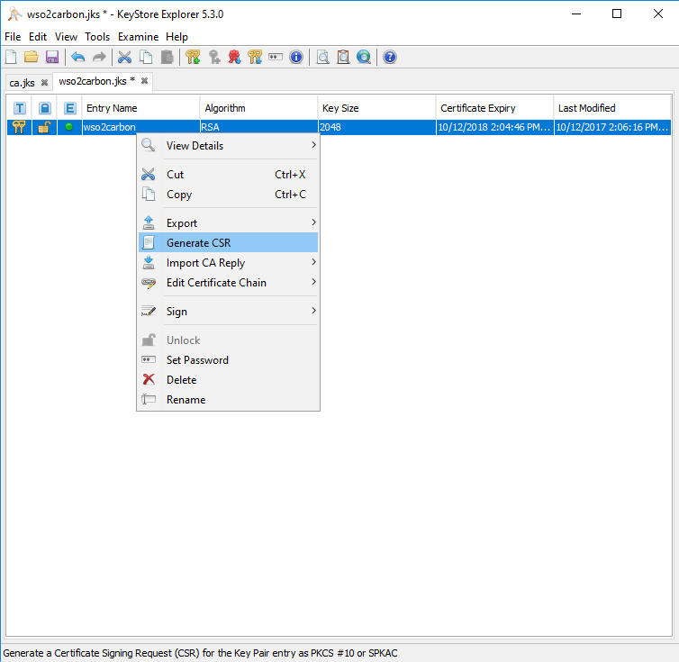
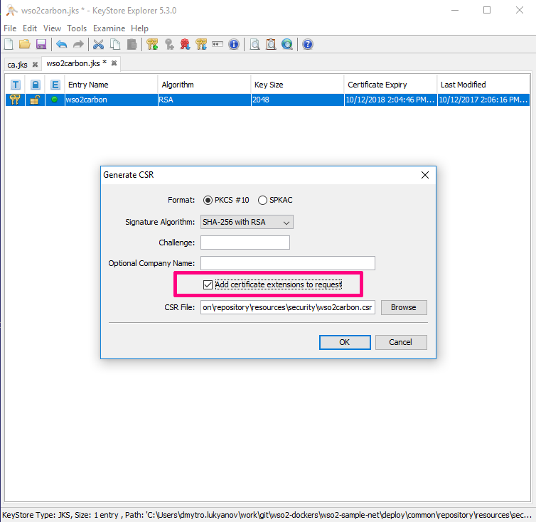

## goal

- generate wso2carbon.jks JKS keystore for `*.docker.local`
- create CA keypair for custom Certificate authority
- sign the certificate in keystore with CA certificate
- import public CA certificate into truststore

## tool

all above teoretically possible to do with keytool + openssl tools
but for simplicity I used http://keystore-explorer.org/

## files in this directory

> all the keystores secured with default wso2 password: `wso2carbon`

- `ca.jks` the keystore with keypair to be a CA (Certificate authority) certificate
- `wso2carbon.jks` the keystore with primary keypair to be used for wso2 servers signed with CA certificate 
- `client-truststore.jks` the truststore. here we imported public part of CA certificate
- `extension.tpl` template with extensions for certificates. you can import and modify them in `keystore-explorer`
- `_.docker.local.csr` temporary intermediate file - the request to sign certificate
- `_.docker.local.p7r` temporary intermediate file - the reply to sign certificate request
- `ca.docker.local.cer` public CA certificate to be imported into client's truststore (browsers, etc.)

## steps

#### generate CA keystore with key-pair
normally you don't need to regenerate this certificate if you trust it

don't forget to set CA=TRUE in Basic Constraints

#### generate wso2carbon.jks with name and alternate names we need
- `*.docker.local` for our subnet names
- `192.168.99.100` as default ip for default local docker machine
- `localhost` for localhost access

#### generate request for signature 

#### include extension into request 

#### sign the request with CA certificate
don't forget to specify extension in reply 

#### import the signature reply into wso2carbon.jks

#### wso2carbon.jks result

#### export public CA certificate

#### export public CA certificate - 2

#### import public CA certificate into truststore

