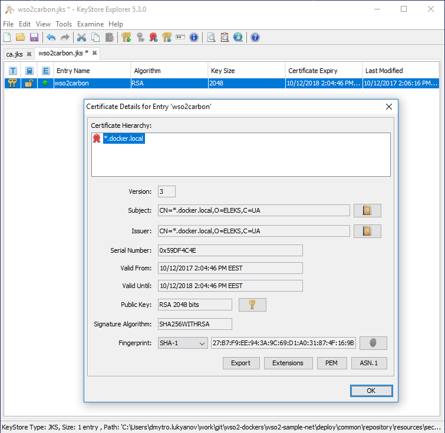
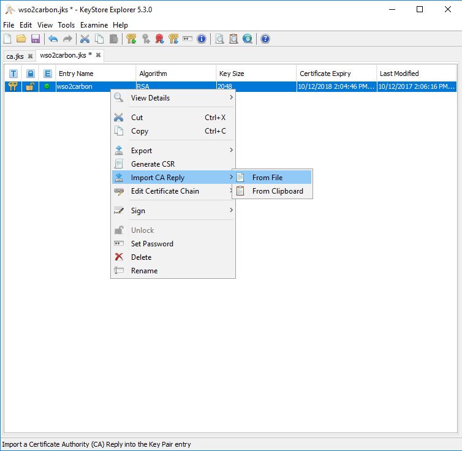
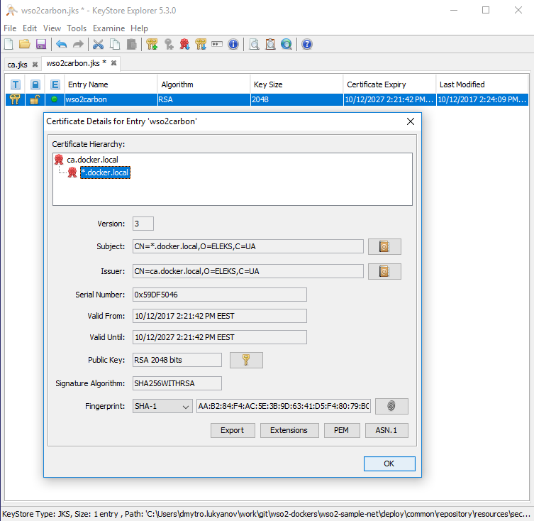

## goal

- generate wso2carbon.jks JKS keystore for `*.docker.local`
- create CA keypair with custom authority
- sign the certificate in keystore with CA certificate
- import public CA certificate into truststore

## tool

all above teoretically possible to do with keytool + openssl tools
but for simplicity I used http://keystore-explorer.org/

## steps

#### generate CA keystore with key-pair

#### generate wso2carbon.jks with name and alternate names we need
- `*.docker.local` for out subnet names
- `192.168.99.100` as default ip for default local docker machine
- `localhost` for localhost access

#### generate request for signature 

#### sign the request with CA certificate

#### import the signature reply into wso2carbon.jks

#### wso2carbon.jks result

#### export public CA certificate

#### export public CA certificate - 2

#### import public CA certificate into truststore

